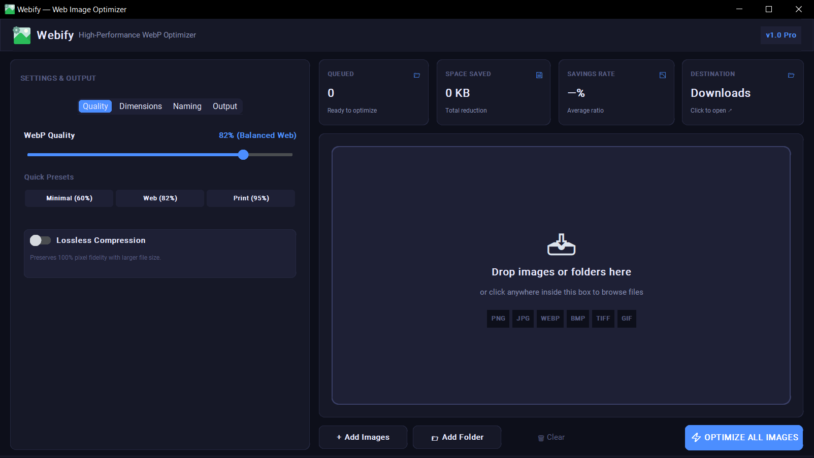

# ⚡ Webify

<p align="center">
  
</p>

<p align="center">
  <b>Modern WebP Image Optimizer & SEO Slug Generator</b><br>
  <i>Optimiseur d'images WebP & Générateur de Slugs SEO</i><br>
  <i>أداة تحسين وضغط صور WebP وتوليد روابط الـ SEO</i>
</p>

<p align="center">
  <a href="#-english">English</a> •
  <a href="#-français">Français</a> •
  <a href="#-العربية">العربية</a>
</p>

<p align="center">
  
</p>

---

## 🇬🇧 English

### Overview
**Webify** is a fast, lightweight Windows desktop application designed to convert images to the modern **WebP** format, reduce file size by up to 85%+, and automatically generate clean, SEO-friendly file names.

### ✨ Key Features
- ⚡ **High-Efficiency WebP Conversion**: Compress images with minimal quality loss (includes a 100% Lossless mode and quality slider).
- 🔤 **SEO Slug Generator**: Automatically cleans up special characters, accents, and symbols into clean web slugs (e.g. `Été 2024 & Plage!` ➔ `ete-2024-and-plage.webp`).
- 📐 **Smart Resizing**: Aspect-ratio locked resizing with instant presets (Original, FHD, HD, Web).
- 📂 **Drag & Drop / Batch Processing**: Drop individual images or entire folders to convert in bulk.
- 🚀 **Portable & Fast**: Standalone executable (`.exe`) with no installation required.

### 🚀 Getting Started

#### Option 1: Standalone App (Recommended)
1. Download `Webify.exe` from the `dist/` folder or Releases.
2. Double-click **`Webify.exe`** to start immediately.

#### Option 2: Run with Python
```bash
git clone https://github.com/abdellah-agrm/Webify.git
cd Webify
pip install -r requirements.txt
python app.py
```

---

## 🇫🇷 Français

### Présentation
**Webify** est une application de bureau Windows rapide et légère conçue pour convertir vos images au format moderne **WebP**, réduire leur poids jusqu'à plus de 85%, et renommer automatiquement vos fichiers avec des slugs optimisés pour le référencement naturel (SEO).

### ✨ Fonctionnalités
- ⚡ **Conversion WebP haute performance** : Compressez vos images tout en préservant leur qualité visuelle (curseur de qualité + mode sans perte 100%).
- 🔤 **Générateur de Slugs SEO** : Nettoie automatiquement les accents, symboles et espaces (ex. : `Été 2024 & Plage!` ➔ `ete-2024-and-plage.webp`).
- 📐 **Redimensionnement intelligent** : Verrouillage automatique du ratio pour éviter toute déformation, avec préréglages rapides (FHD, HD, Web).
- 📂 **Glisser-Déposer & Traitement par lot** : Déposez des fichiers individuels ou des dossiers complets.
- 🚀 **Portable et autonome** : Fichier exécutable (`.exe`) prêt à l'emploi sans installation requise.

### 🚀 Démarrage rapide

#### Option 1 : Application autonome (Recommandé)
1. Téléchargez `Webify.exe` dans le dossier `dist/` ou la section Releases.
2. Double-cliquez sur **`Webify.exe`** pour lancer l'application.

#### Option 2 : Lancement avec Python
```bash
git clone https://github.com/abdellah-agrm/Webify.git
cd Webify
pip install -r requirements.txt
python app.py
```

---

<div dir="rtl">

## 🇸🇦 العربية

### نبذة عن البرنامج
**Webify** هو تطبيق خفيف وسريع لأنظمة ويندوز مخصص لتحويل الصور وضغطها إلى صيغة **WebP** الحديثة، مما يقلل حجم الملفات بنسبة تتجاوز 85% مع توليد أسماء ملفات نظيفة ومهيأة لمحركات البحث (SEO).

### ✨ المميزات الرئيسية
- ⚡ **تحويل فائق السرعة إلى WebP**: ضغط قوي للصور مع الحفاظ على وضوحها (شريط تحكم في الجودة + خيار ضغط بدون فقدان Lossless).
- 🔤 **توليد أسماء مهيأة للـ SEO**: تحويل الحروف الخاصة والرموز تلقائياً إلى روابط ويب نظيفة (مثال: `Été 2024 & Plage!` ➔ `ete-2024-and-plage.webp`).
- 📐 **تغيير الأبعاد مع الحفاظ على النسبة**: حساب تلقائي وفوري للأبعاد لمنع تشوه الصور مع مقاسات جاهزة (FHD، HD، Web).
- 📂 **السحب والإفلات والمعالجة الجماعية**: إمكانية سحب الصور المنفردة أو مجلدات كاملة ومعالجتها دفعة واحدة.
- 🚀 **برنامج محمول وسريع**: ملف تنفيذي مباشر (`.exe`) يعمل دون الحاجة لتثبيت أي برامج إضافية.

### 🚀 طريقة التشغيل

#### الخيار الأول: تشغيل البرنامج الجاهز (موصى به)
1. حمّل ملف **`Webify.exe`** من مجلد `dist/` أو قسم الإصدارات (Releases).
2. انقر نقراً مزدوجاً على **`Webify.exe`** لبدء الاستخدام مباشرة.

#### الخيار الثاني: التشغيل عبر Python
```bash
git clone https://github.com/abdellah-agrm/Webify.git
cd Webify
pip install -r requirements.txt
python app.py
```

</div>

---

## 📄 License
MIT License.
